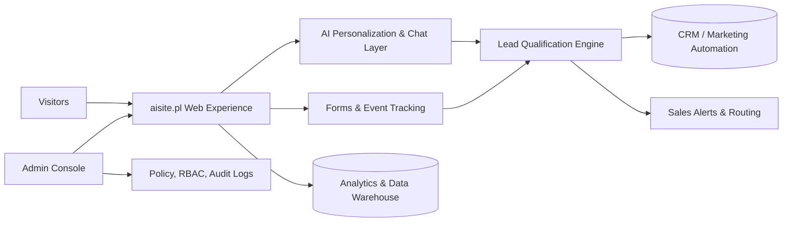

# aisite.pl

**aisite.pl helps businesses launch high-converting, AI-powered websites in days instead of months.**

## Who it’s for

- **SMBs** that need a fast, affordable way to capture and qualify leads.
- **Agencies** delivering repeatable, white-labeled website and automation projects.
- **Enterprise teams** that require governance, security controls, and scalable deployment workflows.
- **In-house growth and RevOps teams** looking to connect web experiences directly to CRM and support tools.

## Key business outcomes

- **Higher lead conversion** through personalized content, AI chat, and automated lead routing.
- **Automation savings** by replacing manual qualification, follow-ups, and handoffs.
- **Faster deployment speed** with reusable templates, prebuilt integrations, and guided setup.
- **Improved sales responsiveness** via real-time alerts and CRM sync.
- **Lower operational overhead** through centralized content, forms, and analytics.

## Feature overview

- AI-assisted landing page and website generation
- Conversational lead capture and qualification
- Built-in analytics and conversion tracking
- CRM, calendar, and email integrations
- Multi-site management and role-based access
- Template library with brand customization
- Workflow automation for follow-up and handoff
- Audit logs and governance controls (Enterprise)

### Plans comparison

| Capability | Starter | Pro | Enterprise |
|---|---:|---:|---:|
| Sites included | 1 | Up to 10 | Unlimited |
| AI page generation | ✅ | ✅ | ✅ |
| Lead capture forms | ✅ | ✅ | ✅ |
| AI chat assistant | Basic | Advanced | Advanced + custom prompts |
| Integrations (CRM/email/calendar) | Limited | Standard | Full + custom connectors |
| Workflow automations | 3 workflows | Unlimited | Unlimited + approval flows |
| Team members | 2 | 15 | Unlimited |
| Analytics dashboard | Standard | Advanced | Advanced + export API |
| SSO / SCIM | — | — | ✅ |
| Audit logs | — | ✅ | ✅ |
| SLA & dedicated support | — | Standard | Priority + TAM |

## Security & compliance

- **Data handling:** Customer content and lead data are encrypted in transit (TLS) and at rest (AES-256).
- **Hosting region:** EU-first hosting with regional options for data residency requirements.
- **Access controls:** Role-based permissions, optional SSO, and granular workspace-level access.
- **Operational safeguards:** Audit trails, backup policies, and environment separation for production workloads.
- **Compliance posture:** Security controls aligned with common enterprise requirements; detailed documentation available during procurement.

## Contact & sales

- 📩 **Sales:** [sales@aisite.pl](mailto:sales@aisite.pl)
- 📅 **Book a demo:** [https://aisite.pl/demo](https://aisite.pl/demo)
- 🌐 **Website:** [https://aisite.pl](https://aisite.pl)

## Screenshots / GIFs

> Replace these placeholders with product assets from your latest release.


## High-level architecture (for technical buyers)



## WSL Ubuntu workflow

This repository includes a minimal WSL Ubuntu setup for local editing and preview on Windows.

### Open the repository in Ubuntu from VS Code

Run the VS Code task `WSL: Open Repo In Ubuntu`.

Or use PowerShell directly from the repo root:

```powershell
powershell -NoProfile -ExecutionPolicy Bypass -File .\scripts\open-in-wsl-ubuntu.ps1
```

That reopens the current repository through the `Ubuntu` WSL distro so terminals, Git, and tooling run in Linux.

### Serve the static portfolio from Ubuntu

Run the VS Code task `WSL: Serve Portfolio`.

Or use PowerShell directly:

```powershell
powershell -NoProfile -ExecutionPolicy Bypass -File .\scripts\serve-portfolio-wsl.ps1
```

Then open:

```text
http://127.0.0.1:4173
```

The server runs `python3 -m http.server 4173` inside the `Ubuntu` distro from the `portfolio/` directory.
