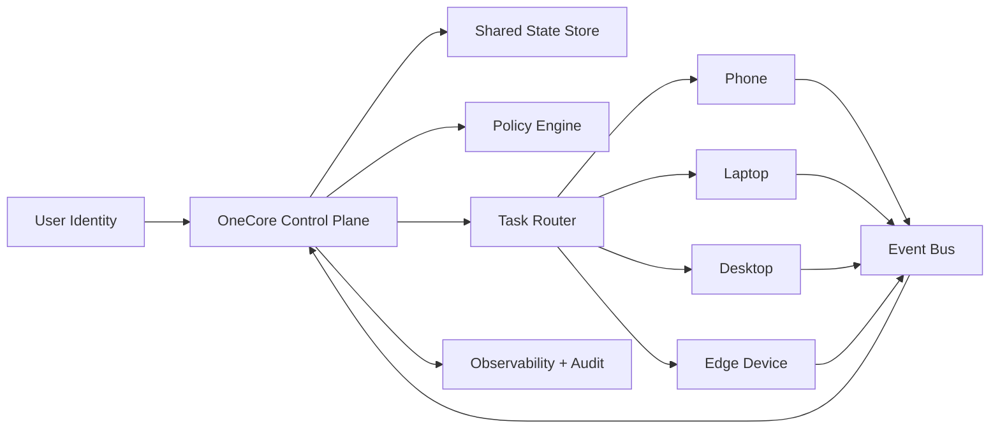

# OneCore Concept

OneCore is a product direction for making many devices behave like one coordinated system instead of a set of isolated endpoints.

## Core idea

Every device keeps its own local runtime, but all devices share the same:

- identity
- policy
- task graph
- state synchronization model
- event stream

The result is a mesh where a phone, laptop, desktop, kiosk, or embedded device can pick up work from the same shared core.

## Design goals

- One identity across all devices and sessions
- Shared state with fast local reads and conflict-safe sync
- Capabilities discovered dynamically per device
- Tasks routed to the best available device
- Offline-first behavior with delayed reconciliation
- Admin visibility into every device, session, and action

## Reference architecture

## System layers

### 1. Identity layer

All devices attach to the same user or workspace identity. Device trust, session lifecycle, and access rights are managed centrally.

### 2. Capability layer

Each device advertises what it can do, for example:

- camera
- microphone
- GPU inference
- background sync
- local storage
- large display output

This allows the system to route work by capability instead of hardcoding device roles.

### 3. Sync layer

Each device keeps a local cache and syncs through append-only events plus snapshot materialization. The preferred model is:

- local-first writes
- event sourcing for auditability
- CRDT or version-vector conflict handling where concurrent edits matter
- background reconciliation when connectivity returns

### 4. Orchestration layer

The task router decides where work runs. Example rules:

- notifications go to the phone
- heavy processing goes to the desktop
- camera capture goes to the mobile device
- presentation mode goes to the largest available screen

### 5. Experience layer

The UI should feel like one session that can move between devices. Users should be able to start an action on one device and continue it on another without manual export, relogin, or reconfiguration.

## MVP scope

The smallest credible OneCore-style implementation should include:

1. One shared account across devices
2. Device registration and presence tracking
3. Shared task inbox synchronized in near real time
4. Cross-device handoff for one workflow
5. Unified audit trail of actions and device state

## Suggested stack

- Frontend: responsive web app plus installable PWA shell
- Sync: WebSocket or SSE for live updates, durable queue for retries
- Backend: API plus event log and materialized read models
- Storage: relational database for core entities, append-only event table for history
- Auth: one workspace identity with device-bound sessions
- Observability: per-device heartbeat, action logs, and replayable traces

## Suggested next build sequence

1. Define shared entities: user, workspace, device, capability, session, task, event
2. Build device registration and heartbeat API
3. Add a shared task timeline UI
4. Add handoff actions between devices
5. Add policy rules for routing tasks to the right device

## What this means for this repository

For `ajna-projects`, the next practical step is to evolve the current static site into a product landing page that explains OneCore as a platform:

- one account
- one control plane
- many devices
- one continuous workflow

After that, the next code step should be a small web prototype with:

- device registration
- shared session state
- live presence indicators
- cross-device task handoff